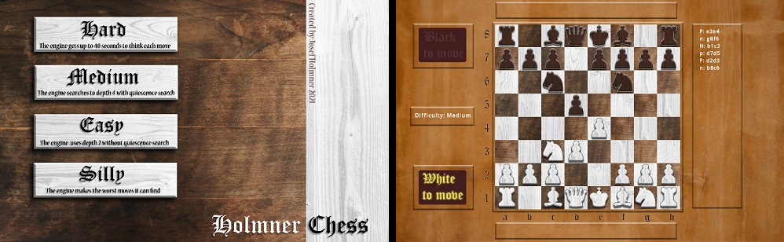

# HolmnerChessEngine

## About
A chess application comprised of an Engine and a Gui (and unint tests), all written in C++.

Alpha-beta pruning is used with unbound quiescence search and a transposition table is used for faster evaluation and better move ordering. The raw "generate move, make move, unmake move" sequence speed is about 3 million nodes/s on a mid-range laptop.
In practice, this roughly corresponds to depth 8 search with unbound quiescence search taking between 2-10 seconds (depending on the position) on a regular laptop.

The Engine uses only the C++ standard library (C++17) and builds to a static library.
The Gui is dependant on SFML and the Engine itself and builds to an executable.

## Build

### Windows
#### Prerequisites
CMake (version > 3.16.3 recommended).
SFML library (version 2.51 recommended).
Visual Studio.

#### Steps
1. Start a command prompt in /HolmnerChessEngine
2. mkdir build
3. cd build
4. cmake -D CMAKE_PREFIX_PATH=**<absolute_path>**/SFML-2.5.1/lib/cmake/SFML ..
5. Open the HolmnerChessEngine.sln file and build (Release configuration recommended).
6. Executable (.exe) will be located in HolmnerChessGui/<configuration>/ after build.

Note: in step 4, replace **<absolute_path>** with the missing part of the path to SFML.

### Linux
#### Prerequisites
CMake (version > 3.16.3 recommended), (**sudo apt-get install cmake**)
GCC (**sudo apt install build-essential**)
SFML (version 2.51 recommended) (**sudo apt-get install libsfml-dev**)

#### Steps
1. Start a command prompt in /HolmnerChessEngine
2. mkdir build
3. cd build
4. cmake -DCMAKE_BUILD_TYPE=Release ..
5. make
6. Executable will be located in HolmnerChessGui/ after build.
